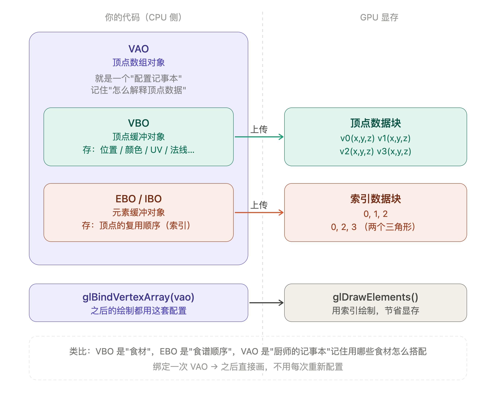

# OpenGL — VAO、VBO、EBO 笔记

## 一句话总结

| 对象 | 全称 | 存什么 | 在哪 |
|------|------|--------|------|
| VBO | 顶点缓冲对象 | 顶点数据（位置、颜色、UV、法线…） | GPU 显存 |
| EBO | 元素缓冲对象 | 顶点索引（复用顺序） | GPU 显存 |
| VAO | 顶点数组对象 | 以上两者的"使用说明" | GPU 状态机 |



---

## 各自是什么

### VBO（Vertex Buffer Object）

一块 GPU 显存，专门存放顶点数据。把顶点数据从 CPU **一次性上传**到 GPU，之后渲染循环里直接用，不用每帧重复传输。

可以存：
- 顶点位置 `(x, y, z)`
- 颜色 `(r, g, b, a)`
- 纹理坐标 UV `(u, v)`
- 法线向量 `(nx, ny, nz)`
- ……任意自定义属性

### EBO（Element Buffer Object，也叫 IBO）

也是一块 GPU 显存，但存放的是**索引**（下标）。

**为什么需要 EBO？**

画一个正方形需要两个三角形，共 6 个顶点，但其中 2 个顶点是重复的：

```
不用 EBO：存 6 个顶点（有重复）
v0, v1, v2,  v0, v2, v3

用 EBO：只存 4 个顶点 + 一组索引
顶点：v0, v1, v2, v3
索引：0, 1, 2,  0, 2, 3
```

顶点越多、重复越多，EBO 节省的显存越可观。

### VAO（Vertex Array Object）

VAO 本身**不存任何顶点数据**，它是一个"配置记事本"，记录：

- 用哪个 VBO？
- 数据怎么解释？（前 3 个 float 是位置，后 2 个 float 是 UV……）
- 用哪个 EBO？

绑定一次 VAO，之后每次画这个物体只需 `glBindVertexArray(vao)`，不用重新配置一遍。

> 类比：VBO 是"食材"，EBO 是"食谱顺序"，VAO 是"厨师的记事本"——记住用哪些食材、怎么搭配。

---

## 典型使用顺序

```c
// 1. 创建并绑定 VAO（开始"录制配置"）
unsigned int vao, vbo, ebo;
glGenVertexArrays(1, &vao);
glBindVertexArray(vao);

// 2. 创建 VBO，上传顶点数据
float vertices[] = {
    // 位置 (x, y, z)
     0.5f,  0.5f, 0.0f,  // v0 右上
     0.5f, -0.5f, 0.0f,  // v1 右下
    -0.5f, -0.5f, 0.0f,  // v2 左下
    -0.5f,  0.5f, 0.0f   // v3 左上
};
glGenBuffers(1, &vbo);
glBindBuffer(GL_ARRAY_BUFFER, vbo);
glBufferData(GL_ARRAY_BUFFER, sizeof(vertices), vertices, GL_STATIC_DRAW);

// 3. 创建 EBO，上传索引数据
unsigned int indices[] = {
    0, 1, 2,  // 第一个三角形
    0, 2, 3   // 第二个三角形
};
glGenBuffers(1, &ebo);
glBindBuffer(GL_ELEMENT_ARRAY_BUFFER, ebo);
glBufferData(GL_ELEMENT_ARRAY_BUFFER, sizeof(indices), indices, GL_STATIC_DRAW);

// 4. 告诉 VAO "数据怎么解释"
// 参数：属性位置=0，分量数=3，类型=float，不归一化，步长，偏移
glVertexAttribPointer(0, 3, GL_FLOAT, GL_FALSE, 3 * sizeof(float), (void*)0);
glEnableVertexAttribArray(0);

// 5. 解绑（配置录制完毕）
glBindVertexArray(0);

// -------- 渲染循环里 --------
glBindVertexArray(vao);                                          // 恢复所有配置
glDrawElements(GL_TRIANGLES, 6, GL_UNSIGNED_INT, 0);            // 用索引绘制
```

---

## 关键 API 速查

| 函数 | 作用 |
|------|------|
| `glGenVertexArrays(n, &vao)` | 创建 n 个 VAO |
| `glBindVertexArray(vao)` | 绑定 VAO（开始录制 / 恢复配置） |
| `glGenBuffers(n, &buf)` | 创建 n 个缓冲对象 |
| `glBindBuffer(target, buf)` | 绑定缓冲（`GL_ARRAY_BUFFER` = VBO，`GL_ELEMENT_ARRAY_BUFFER` = EBO） |
| `glBufferData(target, size, data, usage)` | 上传数据到 GPU |
| `glVertexAttribPointer(...)` | 告诉 VAO 如何解释 VBO 中的数据 |
| `glEnableVertexAttribArray(loc)` | 启用顶点属性 |
| `glDrawArrays(mode, first, count)` | 不用索引直接画 |
| `glDrawElements(mode, count, type, offset)` | 用 EBO 索引画 |

---

## 常见误区

**Q：VAO 里面存了 VBO 的数据吗？**
不，VAO 只记录"怎么读 VBO"的配置，数据还在 VBO（GPU 显存）里。

**Q：EBO 一定要配合 VAO 用吗？**
技术上不是必须的，但实际开发中几乎都一起用，因为 VAO 会自动记住绑定的 EBO。

**Q：`GL_STATIC_DRAW` 是什么意思？**
告诉 GPU 这块数据"上传一次，多次读取，很少修改"，GPU 会做相应的内存优化。对应的还有 `GL_DYNAMIC_DRAW`（频繁修改）和 `GL_STREAM_DRAW`（每帧都变）。

---

*参考：[LearnOpenGL](https://learnopengl.com/)*
